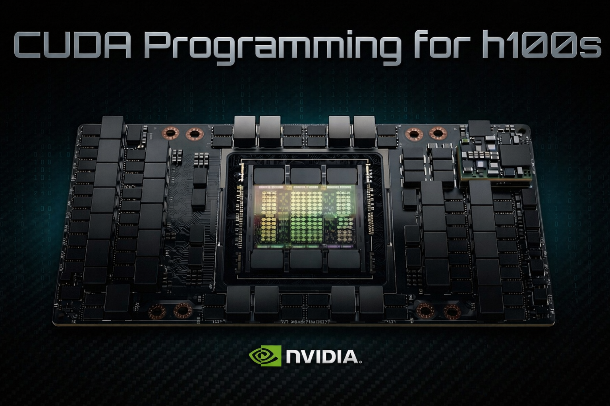

<h1 align="center">CUDA Programming for NVIDIA H100s</h1>

<p align="center">
  A course by <a href="https://prateekshukla.com"><strong>Prateek Shukla</strong></a><br />
  Hopper taught as the asynchronous machine.
</p>

<p align="center">
  
</p>

<p align="center">
  <a href="https://cudacourseh100.github.io/">Course Website</a> ·
  <a href="https://cudacourseh100.github.io/slides.html">Slides</a> ·
  <a href="#curriculum">Curriculum</a> ·
  <a href="#important-resources">Important Resources</a>
</p>

<p align="center">
  <a href="https://x.com/_PrateekShukla_">𝕏</a> ·
  <a href="https://github.com/sponsors/prateekshukla1108">Sponsor</a> ·
  <a href="https://prateekshukla.com">Website</a>
</p>


## Course Website

**Start here:** [https://cudacourseh100.github.io/](https://cudacourseh100.github.io/)

The course website contains the lesson pages, slide decks, and the structured path through all the material. This README is a reference — the website is where you learn.

---

## Clone With Submodules

This repository uses Git submodules for `ThunderKittens` and `cutlass`. If you use a plain `git clone`, those directories will be created without their contents.

Clone the repository like this:

```bash
git clone --recurse-submodules https://github.com/cudacourseh100/H100-Course.git
```

If you already cloned the repo without submodules, run:

```bash
git submodule update --init --recursive
```

If you want Git to do this automatically for future clones on your machine, you can also set:

```bash
git config --global clone.recurseSubmodules true
```

This course is about how modern H100-class kernels actually work. It covers the asynchronous Hopper execution model, descriptor-driven data movement, synchronization under overlap, tensor-core issue through WGMMA, warp-specialized kernel design, and the multi-GPU orchestration required for real training systems.

This is not a beginner CUDA crash course. It is built for engineers who want the machine model, the PTX-level mechanisms, and the systems context together.

| Course Info | Details |
| --- | --- |
| Instructor | [Prateek Shukla](https://prateekshukla.com) |
| Course site | [cudacourseh100.github.io](https://cudacourseh100.github.io/) |
| Format | 10 lessons plus a Stream-K, Kernel Launch interlude |
| Core topics | `mbarrier`, TMA, `CUtensorMap`, `cp.async.bulk`, WGMMA, kernel design, NVLink, NCCL, Slurm |

## What You'll Learn

- How Hopper shifts CUDA programming toward overlap-first execution.
- How data moves from HBM to L2 to shared memory to tensor cores.
- How `mbarrier`, proxy fences, and wait rules make asynchronous execution correct.
- How `CUtensorMap` and `cp.async.bulk` turn movement into a real pipeline primitive.
- How WGMMA changes tensor-core programming from warp-level thinking to warpgroup-level thinking.
- How modern H100 kernels are structured with warp specialization, persistent scheduling, and staged pipelines.
- How multi-GPU systems use NVLink, NVSwitch, PMIx, NCCL, and Slurm to scale beyond one device.

## Prerequisites

This course assumes you already have the following. If any of these are unfamiliar, work through them first — the material will not slow down for gaps here.

- **C/C++ fluency.** You should be comfortable reading and writing C/C++ including pointers, structs, bitwise operations, and manual memory management.
- **Basic CUDA programming.** You should have written and launched CUDA kernels before. You understand thread blocks, grids, shared memory, `__syncthreads()`, and the general host/device execution model.
- **Tiled matrix multiplication on GPU.** You should be able to write (or at minimum follow) a tiled GEMM kernel using shared memory on Ampere-class hardware. If you can't, start with [Simon Boehm's CUDA matrix multiplication walkthrough](https://siboehm.com/articles/22/CUDA-MMM).
- **Comfort reading hardware documentation.** This course references the PTX ISA, CUDA programming guide, and Hopper architecture whitepapers directly. You don't need to have memorized them, but you should not be intimidated by them.

## Hardware Access

This course targets NVIDIA H100 GPUs. If you don't have local access to one, cloud GPU instances are available from several providers:

- [Lambda](https://lambda.ai/instances) — on-demand H100 SXM and PCIe instances, 1x to 8x GPU configurations.
- [RunPod](https://www.runpod.io/product/cloud-gpus) — H100 SXM and PCIe instances with per-second billing.
- [Vast.ai](https://vast.ai/products/gpu-cloud) — GPU marketplace with H100 instances across 40+ data centers.
- [AWS](https://aws.amazon.com/ec2/instance-types/p5/) — P5 instances with 8x H100 SXM GPUs.
- [GCP](https://cloud.google.com/compute/docs/gpus) — A3 instances with H100 GPUs.

For single-GPU experiments (lessons 1–8), a 1x H100 instance is sufficient. Multi-GPU lessons (9–10) require multi-GPU nodes or clusters.

## Who This Is For

- Engineers comfortable with C or C++.
- Learners with prior CUDA exposure who want to understand Hopper properly.
- ML and systems engineers who care about GEMMs, memory movement, synchronization, and utilization.
- People willing to understand PTX, descriptors, layouts, and scheduling.

## Curriculum

The full lesson pages live on the course website. Browse all slides here: [cudacourseh100.github.io/slides.html](https://cudacourseh100.github.io/slides.html).

| Lesson | Focus | Link |
| --- | --- | --- |
| 1 | H100 architecture, memory hierarchy, SMSPs, Tensor Cores, and the shift to asynchronous execution. | [Introduction to H100s](https://cudacourseh100.github.io/pages/lesson-1.html) |
| 2 | Thread block clusters, distributed shared memory, inline PTX, state spaces, data types, and pointer conversions. | [Clusters, Data Types, Inline PTX, Pointers](https://cudacourseh100.github.io/pages/lesson-2.html) |
| 3 | `mbarrier`, proxy separation, RAW and WAR hazards, cluster barriers, and correctness under overlap. | [Asynchronicity and Barriers](https://cudacourseh100.github.io/pages/lesson-3.html) |
| 4 | `CUtensorMap`, descriptor fields, swizzle, interleave, L2 promotion, and descriptor-driven TMA movement. | [cuTensorMap](https://cudacourseh100.github.io/pages/lesson-4.html) |
| 5 | Structured and unstructured bulk copies, TMA-backed movement, completion, multicast, prefetch, and cache policy. | [`cp.async.bulk`](https://cudacourseh100.github.io/pages/lesson-5.html) |
| 6 | Warpgroups, `wgmma.mma_async`, `ldmatrix`, shared-memory descriptors, and tensor-core operand setup. | [WGMMA Part 1](https://cudacourseh100.github.io/pages/lesson-6.html) |
| 7 | Commit and wait groups, `stmatrix`, FP8 packing, sparse WGMMA, and the full warpgroup lifecycle. | [WGMMA Part 2](https://cudacourseh100.github.io/pages/lesson-7.html) |
| 8 | Arithmetic intensity, warp specialization, circular buffering, ping-pong vs cooperative pipelines, persistent scheduling, and epilogues. | [Kernel Design](https://cudacourseh100.github.io/pages/lesson-8.html) |
| 8.1 | Stream-K scheduling, split ownership, fixup, grouping, and tail-wave utilization. | [Stream-K](https://cudacourseh100.github.io/pages/lesson-8.1.html) |
| 8.2 | Kernel Launch Bounds, Grid Constants, Dependent Grids, Programmatic Stream Serialization  | [Kernel-Launch](https://cudacourseh100.github.io/pages/lesson-8.2.html) |
| 9 | DGX H100 topology, NVLink, NVSwitch, ConnectX, rails, peer access, and UVA. | [Multi GPU Part 1](https://cudacourseh100.github.io/pages/lesson-9.html) |
| 10 | Slurm, PMIx, NCCL communicators, collectives, and data, tensor, pipeline, and expert parallelism. | [Multi GPU Part 2](https://cudacourseh100.github.io/pages/lesson-10.html) |

## Code Anchors

The course repeatedly maps ideas back to real Hopper code instead of stopping at slides. Important anchors include:

- `sm90_gemm_tma_warpspecialized_pingpong.hpp`
- `sm90_gemm_tma_warpspecialized_cooperative.hpp`
- `sm90_mma_tma_gmma_ss_warpspecialized.hpp`
- `sm90_mma_tma_gmma_rs_warpspecialized.hpp`
- `sm90_tile_scheduler.hpp`
- `sm90_tile_scheduler_group.hpp`
- `sm90_tile_scheduler_stream_k.hpp`
- `sm90_epilogue_tma_warpspecialized.hpp`
- `fast.cu`
- `matmul_12.cuh`

## Errata

Found an error? Open an issue on this repository. Include the lesson number, what's wrong, and what the correction should be. Pull requests with fixes are also welcome.

## Important Resources

<details open>
<summary><strong>Start Here</strong></summary>

- [CUDA Programming course by Elliot!](https://www.youtube.com/watch?v=86FAWCzIe_4)
- [GPU Mode: GPU Programming Fundamentals and ThunderKittens](https://www.youtube.com/watch?v=Cl2B_hmg4gA&t=7541s)
- [CUDA + ThunderKittens (Actually very informative)](https://www.youtube.com/watch?v=xcpEl0cGCC4&t=2335s)
- [GPU Mode Compute and Memory Basics](https://www.youtube.com/watch?v=lTmYrKwjSOU)
- [NVIDIA Introduction to CUDA C++ and C](https://developer.nvidia.com/blog/easy-introduction-cuda-c-and-c/)

</details>

<details>
<summary><strong>Books</strong></summary>

- [CUDA for Deep Learning](https://www.manning.com/books/cuda-for-deep-learning) - best for learning CUDA
- [Programming Massively Parallel Processors](https://www.oreilly.com/library/view/programming-massively-parallel/9780323984638/)
- [AI Systems Performance](https://www.oreilly.com/library/view/ai-systems-performance/9798341627772/) - not exactly a CUDA book, but very useful

</details>

<details>
<summary><strong>Important Blogs and Papers</strong></summary>

- [Inside NVIDIA GPUs: Anatomy of High Performance Matmul Kernels](https://www.aleksagordic.com/blog/matmul)
- [NVIDIA Hopper Architecture In-Depth](https://developer.nvidia.com/blog/nvidia-hopper-architecture-in-depth/)
- [Benchmarking and Dissecting the Nvidia Hopper GPU Architecture](https://arxiv.org/pdf/2402.13499)
- [DeepGEMM: Clean and Efficient FP8 GEMM Kernels](https://github.com/deepseek-ai/DeepGEMM)
- [Deep Dive on the Hopper TMA Unit for FP8 GEMMs](https://pytorch.org/blog/hopper-tma-unit/)
- [Outperforming cuBLAS on H100: a Worklog](https://cudaforfun.substack.com/p/outperforming-cublas-on-h100-a-worklog)
- [A Case Study in CUDA Kernel Fusion: Implementing FlashAttention-2 on NVIDIA Hopper Architecture using the CUTLASS Library](https://arxiv.org/pdf/2312.11918)

</details>

<details>
<summary><strong>Colfax</strong></summary>

- https://research.colfax-intl.com/cutlass-tutorial-persistent-kernels-and-stream-k/
- https://research.colfax-intl.com/epilogue_visitor_tree/
- https://research.colfax-intl.com/cutlass-tutorial-design-of-a-gemm-kernel/
- https://research.colfax-intl.com/cutlass-tutorial-wgmma-hopper/
- https://research.colfax-intl.com/tutorial-hopper-tma/

</details>

<details>
<summary><strong>Pre-Hopper but Important</strong></summary>

- https://siboehm.com/articles/22/CUDA-MMM
- https://leimao.github.io/blog/CuTe-ldmatrix/
- https://leimao.github.io/article/CUDA-Matrix-Multiplication-Optimization/
- https://leimao.github.io/blog/CUDA-Shared-Memory-Bank-Conflict-Free-Vectorized-Access/
- https://leimao.github.io/blog/NVIDIA-Tensor-Core-MMA-Instruction-TN-Layout/
- https://leimao.github.io/blog/Benchmarking-NVIDIA-Tensor-Core-MMA-Peak-Performances/

</details>

## Acknowledgments

This course would not exist without the work and generosity of the following people and projects:

- [**Elliot Arledge**](https://x.com/elliotarledge) — for inspiring and helping me create this course. Without him, none of this would have been possible.
- [**Aleksa Gordić**](https://www.aleksagordic.com/blog/matmul) — for writing a really good blog on matmul that helped me understand how HBM works and how memory requests are actually processed.
- [**Hazy Research**](https://github.com/HazyResearch/ThunderKittens) — for building ThunderKittens, from which I referred a lot of code throughout the course.
- [**Pranjal Shankhdhar**](https://github.com/pranjalssh/fast.cu) — for writing cuBLAS-beating kernels in `fast.cu`, which I walked through in the course.
- [**NVIDIA CUTLASS**](https://github.com/NVIDIA/cutlass) — the codebase I walked through more than any other. The sm90 kernel implementations in CUTLASS are the ground truth for how Hopper programming actually works.

## Support

If you find this course useful, consider [sponsoring the project](https://github.com/sponsors/prateekshukla1108). If this course helped you, star the repo — it helps others find it.
